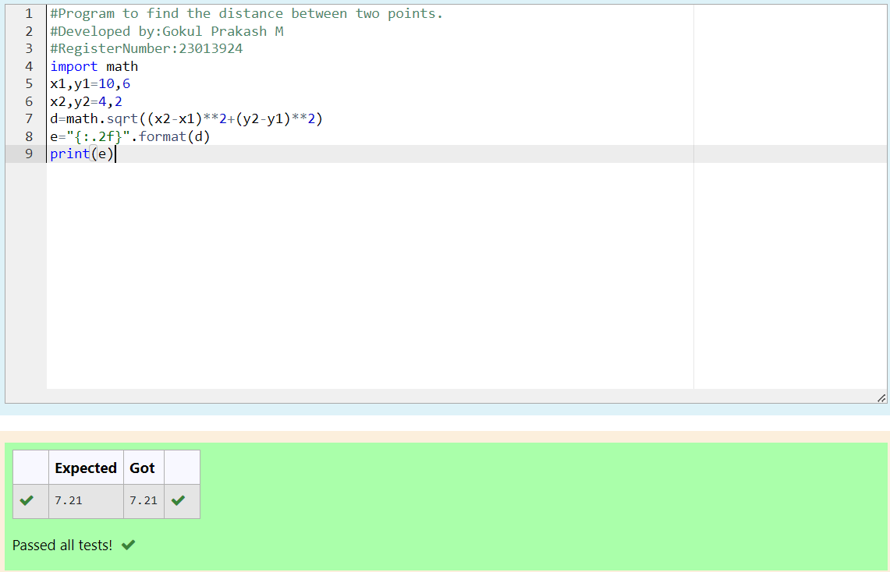

# DISTANCE-BETWEEN-TWO-POINTS

## AIM:
To write a python program to find the distance two 2 points
## ALGORITHM:
### Step 1: 
import math module
### Step 2: 
assign values for x1,y1,x2,y2
### Step 3: 
Substitute the values in the distance formula  
### Step 4: 
format the substituted values 
### Step 5: 
print 
### PROGRAM:
#Program to find the distance between two points.
#Developed by:Gokul Prakash M
#RegisterNumber:23013924
import math
x1,y1=10,6
x2,y2=4,2
d=math.sqrt((x2-x1)**2+(y2-y1)**2)
e="{:.2f}".format(d)
print(e)
  

### OUTPUT:

### RESULT:
thus the distance between two points is successfully executed
